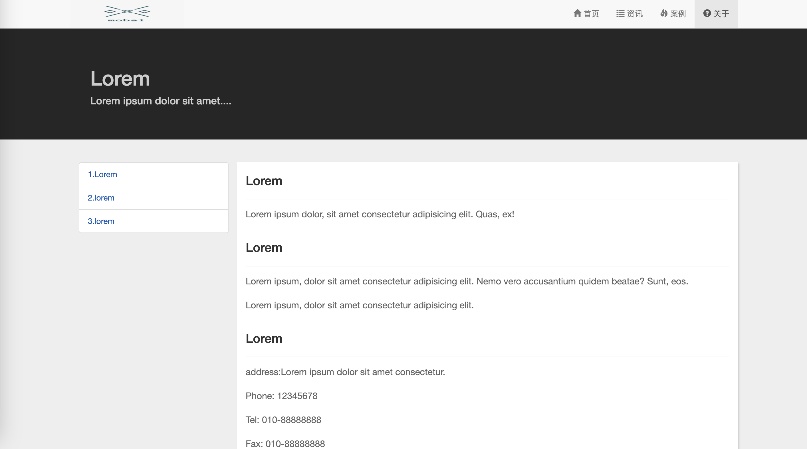

# Bootstrap 实战项目 - 响应式网站

一个基于 Bootstrap 构建的响应式网站模板，包含首页、资讯、案例、关于等多个页面，适合学习Bootstrap框架或快速搭建企业官网。




## 功能特性

- **响应式设计**：适配手机、平板、PC等多种屏幕尺寸
- **Bootstrap组件**：导航栏、轮播图、缩略图、媒体对象等经典组件应用
- **页面模板**：
  - 首页：轮播图+特色服务模块
  - 资讯：新闻列表+侧边栏推荐
  - 案例：栅格化项目展示
  - 关于：锚点导航+联系方式
- **交互特性**：自动轮播、导航栏折叠、平滑滚动

## 技术栈

- Bootstrap
- jQuery
- HTML5/CSS3
- 字体图标（Glyphicons）

## 快速开始

1. 克隆仓库

2. 确保文件结构包含
   ```
   .
   ├── bootstrap
   │   ├── css
   │   ├── fonts
   │   └── js
   ├── image
   └── js
   ```
3. 直接使用浏览器打开任意HTML文件

## 页面结构

| 文件             | 说明                   |
| ---------------- | ---------------------- |
| index.html       | 首页（含轮播图）       |
| information.html | 资讯列表页             |
| case.html        | 案例展示页（栅格布局） |
| about.html       | 关于页面（锚点导航）   |

## 自定义说明

1. **图片替换**：
   - 将页面中的 `image/*.jpg/png` 替换为实际图片
   - 推荐尺寸：
     - Logo: 200x50px
     - 案例图片: 统一尺寸（建议300x200px）

2. **样式调整**：
   - 修改 `style.css` 中的颜色变量：
     ```css
     .jumbotron { background-color: #262626; }
     .tab-h2 { color: #0059B2; }
     ```

## 开发建议

- 使用VS Code的Live Server插件进行本地调试
- 通过浏览器开发者工具调试响应式布局
- 需要网络连接（依赖CDN加载Bootstrap字体）

## 许可证

MIT License © 2025. 基于Bootstrap构建，保留原始框架的LICENSE文件。
---

**提示**：实际使用时需：
1. 添加`bootstrap/`文件夹（包含Bootstrap的CSS/JS文件）
2. 在`image/`目录中添加对应图片文件
3. 根据实际需求修改文字内容和样式
